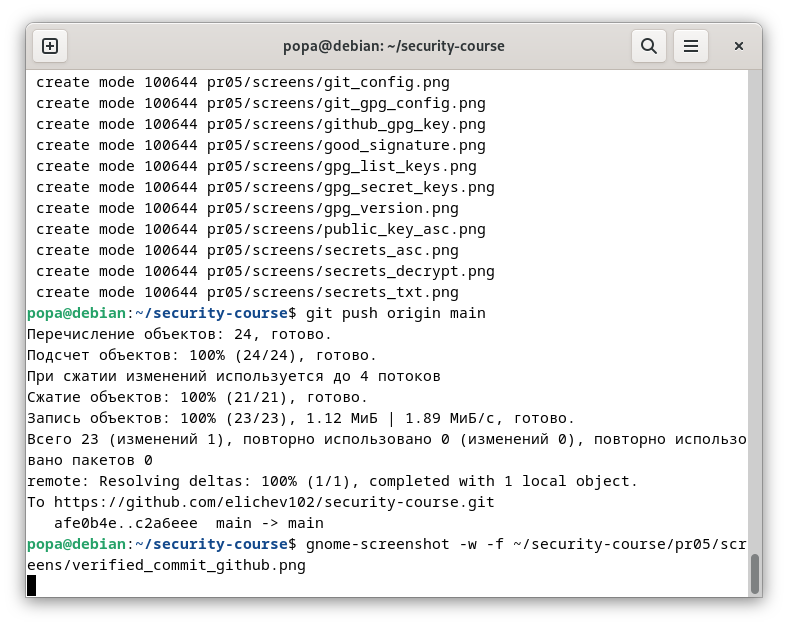

# ПР №5. GPG, подпись коммитов и безвозвратное удаление

## 1. GPG-ключевая пара

- **Key-ID:** 67EB6A9AD641A9E9B3BE1079A54BE4CF6470C02F
- **Тип:** RSA 4096 бит
- **Email:** kstudent803@gmail.com
- **Размер публичного ключа:** 16 строк (с BEGIN до END)

**Что означает флаг --armor:** Вывод ключа в текстовом формате (ASCII), а не в бинарном. Это позволяет копировать ключ и вставлять его в веб-формы (GitHub, почта).

---

## 2. Шифрование

**Зашифрованный файл (первые строки):**
**Можно ли прочитать исходные данные из зашифрованного файла:** Нет, файл зашифрован и без приватного ключа прочитать его невозможно.

**Что произойдёт если ввести неверный пароль при расшифровке:** Расшифровка не удастся — будет ошибка "bad passphrase".

**Почему нельзя расшифровать файл зашифрованный для другого пользователя:** Потому что файл зашифрован на публичном ключе получателя. Расшифровать его может только владелец соответствующего приватного ключа.

---

## 3. Цифровая подпись

**Вывод gpg --verify (Good signature):**
**Вывод gpg --verify после изменения файла (BAD signature):**
**Почему подпись перестала быть действительной после изменения файла:** Подпись — это хэш от содержимого файла, зашифрованный приватным ключом. При изменении файла хэш меняется, и подпись становится недействительной.

**Что именно проверяет gpg --verify:** Проверяет, что файл не был изменён после подписания, и что подпись действительно принадлежит владельцу ключа.

---

## 4. Подпись коммитов

**Ссылка на коммит:** https://github.com/elichev102/security-course/commit/...

**Вывод git log --show-signature -1:**
**Зачем проверять подпись локально если GitHub уже показывает Verified:** Это позволяет убедиться, что подпись действительно валидна и не была подделана на стороне GitHub. Плюс это работает оффлайн.

---

## 5. rm vs shred

| Операция | Что происходит с данными на диске | Можно восстановить? |
|----------|-----------------------------------|---------------------|
| rm | Удаляется только запись в метаданных (inode), данные остаются на диске | Да, пока блоки не перезаписаны |
| shred | Содержимое блоков перезаписывается случайными данными и нулями | Нет |

**Сценарий когда нужно затирать свободное место:** При продаже диска или передаче его другому сотруднику, чтобы гарантированно удалить следы конфиденциальных данных, которые были удалены через rm, но физически остались на диске.

---

## Выводы

В ходе работы были выполнены следующие задачи:
1. Создана GPG-ключевая пара RSA 4096 бит
2. Выполнены шифрование и расшифровка файла с использованием асимметричной криптографии
3. Создана и проверена цифровая подпись файла (Good и BAD signature)
4. GPG-ключ добавлен на GitHub
5. Настроена автоматическая подпись коммитов в Git
6. Получен коммит с зеленым бейджем Verified на GitHub
7. На практике изучена разница между обычным удалением (rm) и безвозвратным уничтожением данных (shred)
