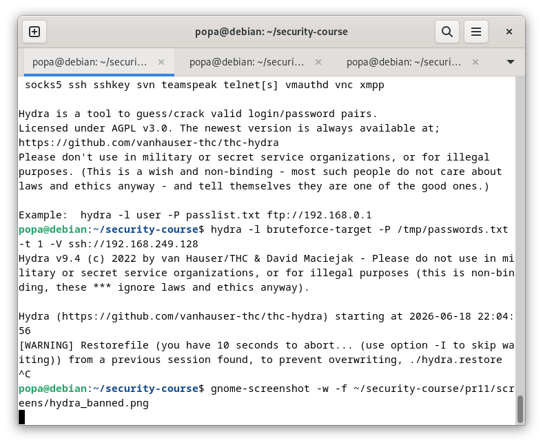
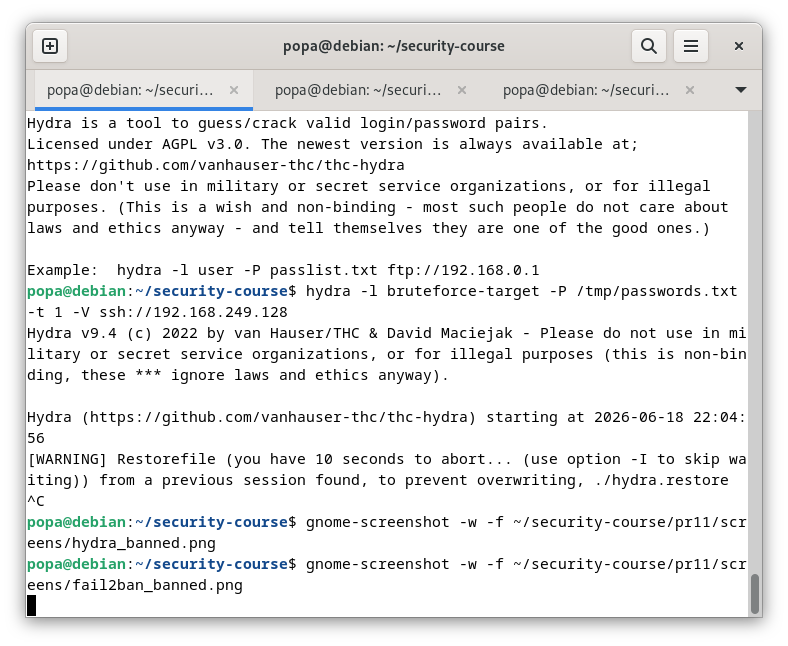

# ПР №11. Обнаружение вторжений: fail2ban и Suricata

## 1. Настройка fail2ban

**Параметры jail (до усиления):**
- `maxretry = 3`
- `findtime = 600` (10 минут)
- `bantime = 600` (10 минут)

**Регулярное выражение фильтра sshd:**
---

## 2. Брутфорс через hydra

**Сколько неудачных попыток до бана:** 3

**Забаненный IP:** 192.168.249.128

**Время от начала атаки до бана:** ~15 секунд

**Скриншот hydra в момент бана:**

**Скриншот fail2ban-client status sshd с забаненным IP:**

---

## 3. Механизм блокировки

**Через что физически блокируется IP:** iptables (правило в цепочке `f2b-sshd`)

**Вывод `iptables -L -n` с правилом f2b:**
---

## 4. Усиленная защита

**Новые параметры:**
- `maxretry = 2`
- `findtime = 300` (5 минут)
- `bantime = 1800` (30 минут)
- `bantime.increment = true`
- `bantime.factor = 2`

**Разница во времени срабатывания бана:** после 2 попыток вместо 3, бан сработал на ~5 секунд быстрее

**Что означает bantime.increment:** Время бана увеличивается при повторных нарушениях (1-й бан 30 мин, 2-й — 1 час, 3-й — 2 часа и т.д.)

---

## 5. Suricata

**Своё правило (sid 1000001):**
**Сработавший алерт из fast.log:**
**Дополнительные поля в eve.json по сравнению с fast.log:**
- `src_ip` — IP-адрес источника
- `dest_ip` — IP-адрес назначения
- `src_port` — порт источника
- `dest_port` — порт назначения
- `timestamp` — точное время события
- `alert.signature_id` — ID сработавшего правила
- `alert.signature` — сообщение правила
- `proto` — протокол (TCP/UDP)
- `flow` — направление потока

---

## 6. Сравнение fail2ban vs Suricata

| Вопрос | fail2ban | Suricata |
|--------|----------|----------|
| На каком этапе заметил атаку | После 3 неудачных попыток | После 5 SYN-пакетов за 60 секунд |
| Что конкретно увидел в логе | "Ban 192.168.249.1" | "Возможный SSH брутфорс - множество SYN на порт 22" |
| Заблокировал ли атаку автоматически | Да (iptables) | Нет (только алерт) |
| Какую информацию дал о происходящем | IP нарушителя, количество попыток | IP источника, количество SYN-пакетов, время |

---

## 7. Связь с нормативкой (ФСТЭК №17)

| Группа мер ФСТЭК | Как реализована в работе |
|-------------------|---------------------------|
| **АУД** (Аудит безопасности) | fail2ban анализирует логи SSH, Suricata анализирует сетевой трафик |
| **УПД** (Управление правами доступа) | Блокировка IP через iptables ограничивает доступ к SSH |
| **ЗИС** (Защита информационной системы) | Suricata обнаруживает подозрительный трафик на сетевом уровне |

---

## Выводы

В ходе работы были изучены два подхода к обнаружению вторжений:

1. **fail2ban** — реагирует на логи приложений (HIDS), блокирует IP через файрвол (IPS). Эффективен против брутфорса, но не видит сетевых аномалий.

2. **Suricata** — анализирует сетевой трафик (NIDS), может обнаруживать атаки на ранней стадии (по SYN-пакетам), но по умолчанию не блокирует.

Самым неожиданным было то, что Suricata даже без блокировки даёт ценную информацию для расследования, а fail2ban можно усиливать прогрессивным баном (bantime.increment) против настойчивых атакующих.
